# D.2. DEMAC: A distributed memory architecture


## Prerequisites
- N/A

## Referenced by:

- ["A.2. DEMAC: Single node installation and setup"](../../A_Single_Core/A_2/README.md) -> [Continue Node Installation](#15-perform-node-installation-x4)

## List of Materials (4-Unit Rack)

This list describes the materials required to build a 4-board cluster

- 1 PC (Preferable with a unix-based OS, other OS are not supported by this procedure)

- 4 Parallella board
(you can get them from DigiKey or other vendors, you can find more information in their website https://www.parallella.org/)

- 4 micro-SD card with at least 16 Gb

- 1 USB Hub (Parallella Power Supply): 
A high quality USB hub with at least 4 ports (2000 mA rated 5 V DC for each board), connector options are: 
  - micro-USB
  - 5.5mm OD / 2.1mm ID center positive polarity plug

- 4 micro-USB Cables
 
- 1 Cooling Fan ***(Warning: The Parallella board requires cooling)***, pc fan options are:
  - 92 mm x 92 mm x 15 mm PC fan
  - 100 mm x 100 mm x 15 mm PC fan

- 1 Cooling fan Power Supply:  
  - For a PC fan you can use a power supply with 12 V and at least 1 A output

- 4 Ethernet Cables (RJ-45)

- 1 Switch or Router RJ-45 5-ports

- 1 Power strip (Ideally surge protected with power switch and at least 6 ports)

- Ethernet connection

3D Printed Parts:

- 4 Frame_01 to support the board

- 1 Frame_02 to hold the board trays (Frame_01)

- 1 Frame_03 to encase the fan

- 1 Frame_05 for the USB power supply

- 1 Frame_06 for the 5-port switch

Optional:

- 1 Frame_04 to complete the cooling system

<!-- ToDo: Add figures for list of materials  -->

## Rack Assembly Instructions 

### 0. Gather 3D Printed frames and other materials

<!-- (ToDo: Add reference to 0_Setup) -->

### 1. Attach Frame_05 to Frame_02

- Frame_05 and Frame_02 should snap together without additional elements

<!-- 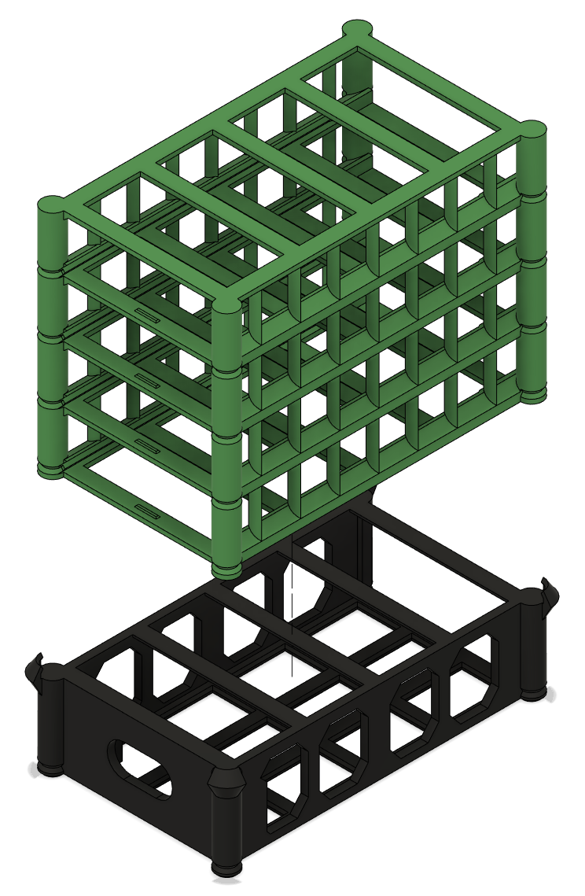 -->


### 2. Attach Frame_06 to Frame_05

- Frame_06 and Frame_05 should snap together without additional elements

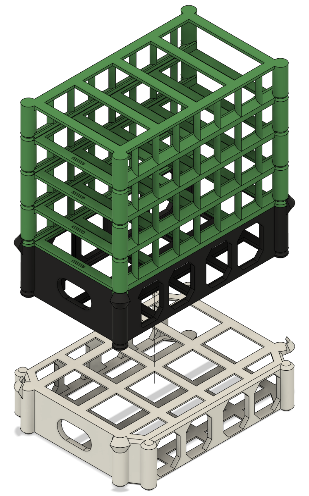


### 3. Place Fan in Frame_03 "Cooling Case"

- Slide the fan in the Frame_03_B
- Place the cable in the cable holder
- Secure the fan using Frame_03_T
- Frame_03_B and Frame_03_T should snap together without additional elements

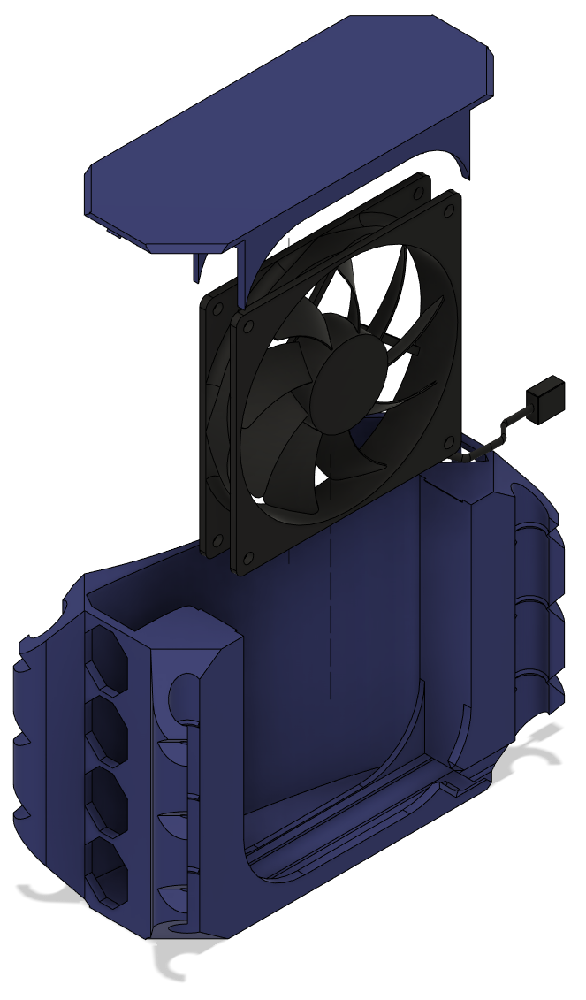


### 4. Attach Frame_03 to Frame_02

- Frame_03 and Frame_02 should snap together without additional elements
- Optionally, attach Frame_04 to Frame_02 

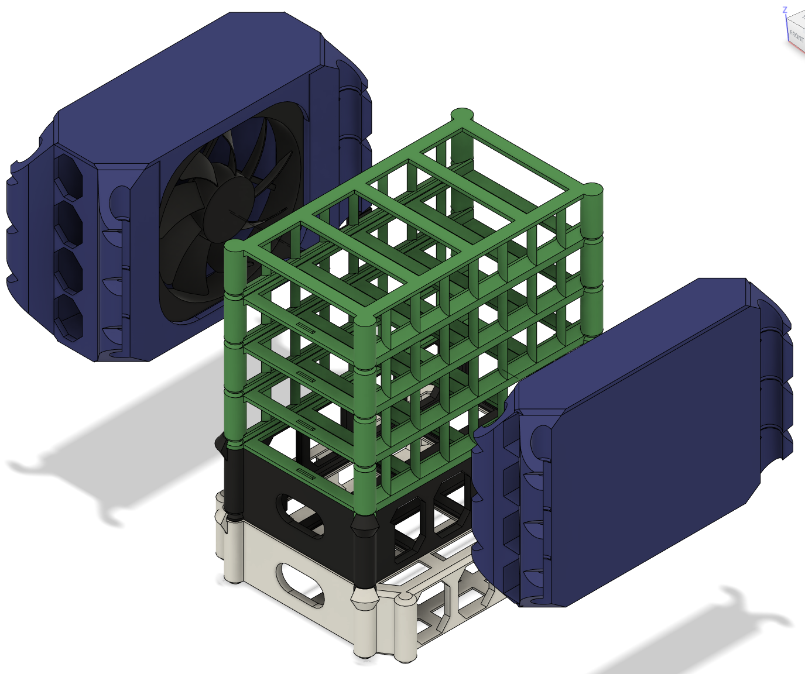

### 5. Connect power strip to outlet (Power: OFF)

- Check that the switch is off before proceeding

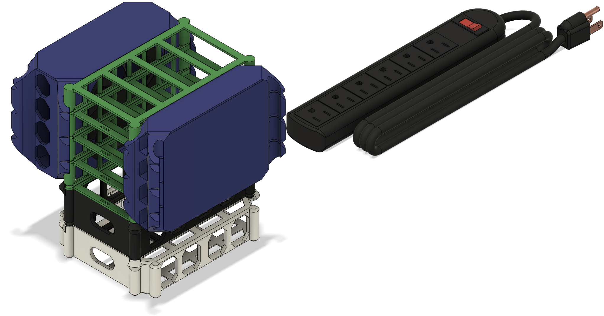

### 6. Place the USB hub in Frame_05 "Power Case"

- Slide the USB hub in Frame_05

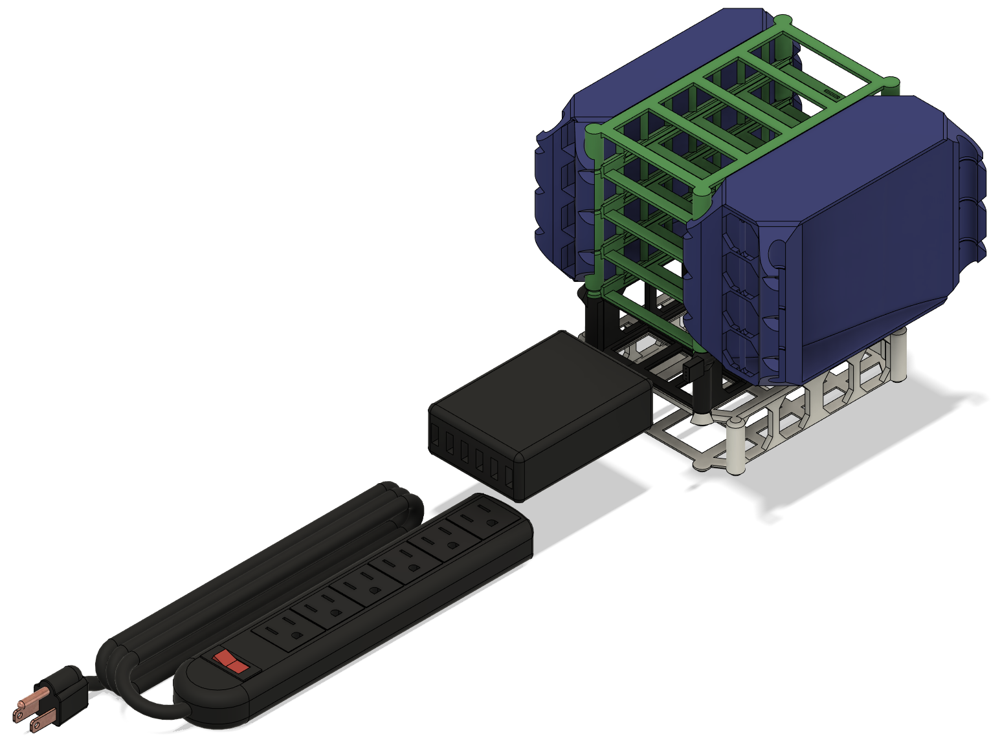

### 7. Connect USB hub to Power Strip (Power: OFF)

- Use the slot in the front of Frame_05 to connect the power cord to the USB hub

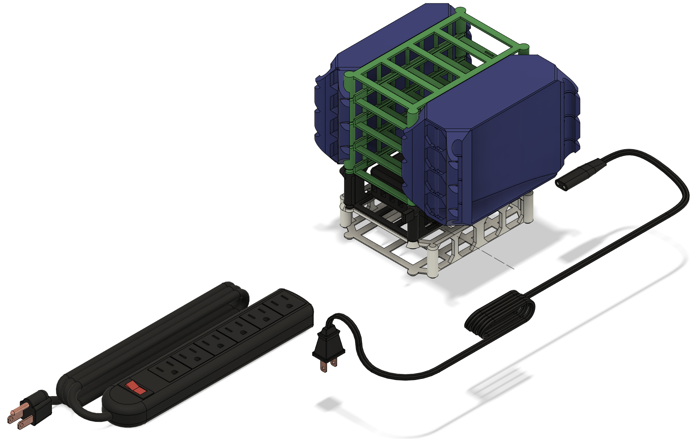

### 8. Place the network switch in Frame_06 "Network Case"

- Slide the network switch in Frame_06

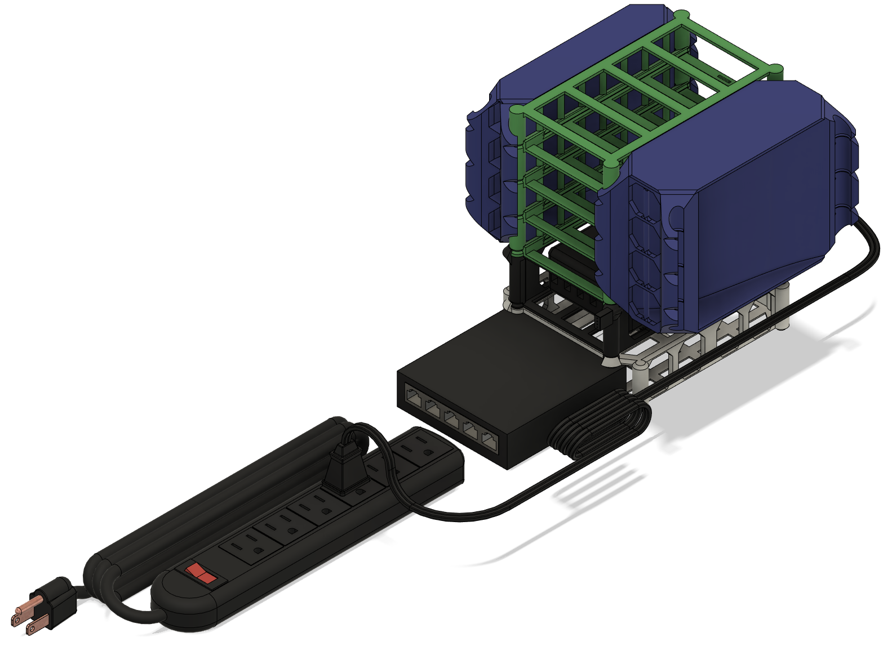

### 9. Connect network switch to Power Strip (Power: OFF)

- Use the slot in the front of Frame_06 to connect the power cord to the network switch

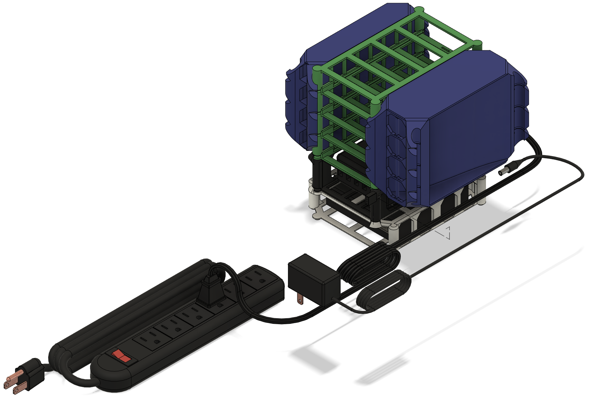

### 10. Connect cooling system to Power Strip (Power: OFF)

- Attach the power supply to the fan

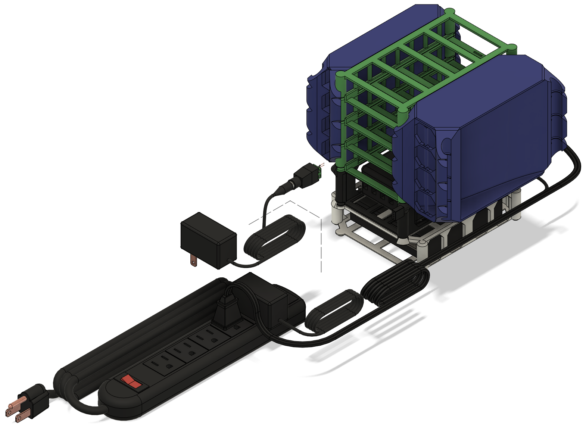

### 11. Energize and test peripherals (Power: ON)

- Check that the cooling system, network switch and USB hub

### 12. Connect the switch to internet

- Check for activity LEDs

### 13. Place Parallella board in Frame_01 "Board Tray" (x4)

- The Parallella board should fit the pins in Frame_01


### 14. Slide Frame_01 into Frame_02 (x4)

- The Parallella board should fit the pins in Frame_01

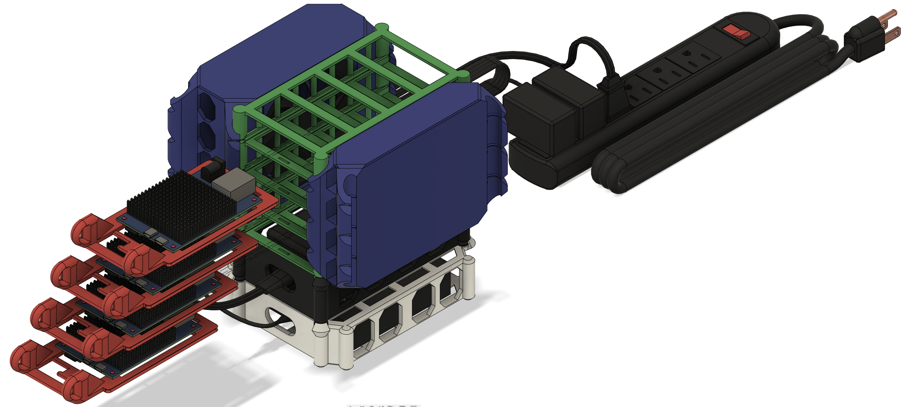

### 15. Perform Node Installation (x4)

<!-- [Node Installation](#node-installation) -->

#### 15.1. Single node installation and setup (x4)

- Follow the instructions in steps 1-6 in the module [A.2. DEMAC: Single node installation and setup](../../A_Single_Core/A_2/README.md)

#### 15.7. Setup Board Hostname

- In Step 7, set up the names of the boards to be different for each board. DEMAC uses hostnames NOPA##, where ## is a two digit number that represents the ID of that node. 

For instance, a 4 unit rack can have names NOPA01, NOPA02, NOPA03, NOPA04. A 24-unit cluster might use NOPA01-24. 

It is possible to use other hostnames, as long as they are unique within the network.

#### 15.8. Setup IP

- In step 8 use the same ## ID of the board to set up the IP of that board.

For example:


NOPA01 IP -> 192.168.10.101

NOPA24 IP -> 192.168.10.124

#### 15.9. Add hostnames from other nodes


- Edit the file `/etc/hosts`

Add the IP address, hostname, and MAC address from other boards to this file. This will provide the required information to communicate different nodes.

```
sudo vim /etc/hosts
```

For example, in a 4-board rack, the `/etc/hosts` file will look like this: 

```
192.168.10.101  NOPA01	[Mac_Address]
192.168.10.102  NOPA02	[Mac_Address]
192.168.10.103  NOPA03	[Mac_Address]
192.168.10.104  NOPA04	[Mac_Address]
```

Replace “[Mac_Address]” with board’s MAC address

#### 15.10. Reboot
 
- Reboot the board to apply the changes.

```
sudo reboot -f
```

#### 15.11. Update && Upgrade

- Updating and upgrading packages might reduce errors that can arise from using outdated software.

```
sudo apt-get update
```

```
sudo apt-get upgrade -y
```
#### 15.12. Copy ssh keys ("paswordless" ssh)

- Make temporary folder in one of the nodes
```
mkdir tmp_ssh
cd tmp_ssh
ssh-keygen -f ./id_rsa 
```

- Press Enter twice for empty passphrase

- Make this new key an authorized key
```
cp id_rsa.pub authorized_keys
```

- Add all NOPAs to the known hosts
```
for i in `seq 0 24`; do j=$(echo $i | awk '{printf "%02d\n", $0}'); ssh-keyscan NOPA$j >> known_hosts; done
cd ..
```


- Make .ssh directory on every node
```
mkdir .ssh
```

- Copy keys for every node using reverse order, assuming this configuration will occur from NOPA01
```
for i in `seq 24 -1 1`; do j=$(echo $i | awk '{printf "%02d\n", $0}'); echo NOPA$j; scp tmp_ssh/* NOPA$j:.ssh/; done
```
Reverse order avoids overwriting the ssh in the current node first


> *Note: The following procedure is only necessary if a new node is added after the previous procedure

- In case a node needs to be added or installed from scratch.

This can be used when a single node has been re-installed. We need to obtain the new node’s host key, add it into the current known hosts to avoid getting the  typical ssh question. Then give the key to the new node, and give the information of the hosts keys to all the nodes. 


In new node:

```
cd /home/parallella
mkdir .ssh
```

In existing node, set the env variable NEW_NODE accordingly: 

```
export NEW_NODE=NOPA## 
ssh-keyscan $NEW_NODE >> ~/.ssh/known_hosts
scp ~/.ssh/* $NEW_NODE:.ssh/
for i in `seq 24 -1 0`; do j=$(echo $i | awk '{printf "%02d\n", $0}'); scp ~/.ssh/known_hosts NOPA$j:.ssh/known_hosts; done
```

Note: If the node has been added before is necessary to remove the key first:
```
ssh-keygen -f "/home/parallella/.ssh/known_hosts" -R "nopa<##>"
ssh-keygen -R 192.168.10.1<##>
```

#### 15.13. Install Ansible

Ansible is an open source IT automation engine that automates provisioning, configuration management, application deployment, orchestration, and many other IT processes.

- Install Ansible using apt-get package manager

```
sudo apt-get install ansible -y
```

- Edit `/etc/ansible/hosts` to add information about other hosts in the system

```
sudo vim /etc/ansible/hosts
```

For example, the `/etc/ansible/hosts` for a 4-board rack might be:

```
NOPA01
NOPA02
NOPA03
NOPA04
```

#### 15.14. Install and configure NSF (HOST)

NFS (Network File System) allows you to 'share' a directory located on one networked computer with other computers/devices on that network. The computer where directory located is called the server and computers or devices connecting to that server are called clients. Clients usually 'mount' the shared directory to make it a part of their own directory structure.

More information in https://help.ubuntu.com/community/SettingUpNFSHowTo.

- In the server run the following commands:

```
sudo mkdir -p DEMAC_nfs
```

```
sudo chmod 777 DEMAC_nfs/
```

```
sudo apt-get install nfs-kernel-server -y
```

```
sudo vim /etc/exports
```

- Add the following text:

```
/home/parallella/DEMAC_nfs 192.168.10.0/24 (rw,nohide,insecure,no_subtree_check,async,no_root_squash)
```
> *Note: 
rw: read and write, 
nohide: exports both filesystems, 
insecure, 
no_subtree_check, 
no_root_squash

```
service nfs-kernel-server restart
```

- Check: 
```
sudo exportfs -v
```

#### 15.15. Install and configure NSF (CLIENTS)
- In the clients run the following commands:

```
mkdir DEMAC_nfs
```

```
sudo apt-get install rpcbind nfs-common -y
```

```
sudo apt-get install autofs -y
```

- Edit '/etc/auto.master'
```
sudo vim /etc/auto.master 
```

- Comment last line and add:

```
/-  /etc/auto.mount
```

- Edit '/etc/auto.mount'
```
sudo vim /etc/auto.mount
```

- Add the following text:

```
/home/parallella/DEMAC_nfs    -rw,user,exec,auto,hard,intr,nosuid,acl    nopa08:/home/parallella/DEMAC_nfs
```

```
sudo service autofs start
```

- Reboot

```
sudo reboot -f
```

- Test nfs

#### 15.16. Install Slurm

##### 15.16.1 Host

Arch
```
sudo pacman -Syu slurm-llnl
```


##### 15.16.2 Client

- Install Munge
```
sudo apt-get install build-essential munge libmunge2 libmunge-dev -y
```

- Install Slurm
```
sudo apt-get install slurm-wlm -y
```


#### 15.17. Install MPI
<!-- Install MPI (Warning, can take hours) -->
```
sudo apt-get install build-essential openssh-server sshpass libpmi0 libpmi0-dev libpmi2-0 libpmi2-0-dev libpmix2 hwloc numactl libc6-dev gfortran -y
sudo apt install mpich -y
```

<!-- ``` -->
<!-- mkdir mpich; cd mpich -->
<!-- ``` -->
<!-- mkdir openmpi; cd openmpi -->

<!-- - Download tar
```
wget https://www.mpich.org/static/downloads/4.2.3/mpich-4.2.3.tar.gz
``` -->
<!-- https://www.open-mpi.org/software/ompi/v4.0/
wget https://download.open-mpi.org/release/open-mpi/v4.0/openmpi-4.0.7.tar.gz -->

<!-- Extract
```
tar xzfv mpich-4.2.3.tar.gz
cd mpich-4.2.3
``` -->

<!-- gunzip -c openmpi-4.0.7.tar.gz | tar xf - -->

<!-- cd openmpi-4.0.7 -->

<!-- ``` -->
<!-- export CFLAGS="-I/opt/slurm/include"
export LDFLAGS="-L/opt/slurm/lib"


./configure --prefix=/usr/local  -->

<!-- ``` -->
<!-- ./configure --prefix=/usr/local --with-pmi=slurm --with-pm=no --with-slurm=/usr/local -->
<!-- ./configure --prefix=/usr/local -->
<!-- ``` -->
<!-- make -j 2 all -->
<!-- make install -->
<!-- ``` -->

<!-- sudo make -j all install -->

<!-- Copy to others -->
<!-- scp openmpi-4.0.4.tar.gz nopa##:~/tmp -->

#### 15.17. Install Jupyter Hub

- Host

Ubuntu
```
sudo apt-get install python3 python3-dev git curl -y
```

Arch
```
sudo pacman -Sy python3 git curl python-pycurl
mkdir Software
cd Software

git clone --depth=1 https://aur.archlinux.org/nodejs-configurable-http-proxy.git
cd nodejs-configurable-http-proxy
makepkg -si

cd ..
git clone --depth=1 https://aur.archlinux.org/python-certipy.git
cd python-certipy
makepkg -si

cd ..
git clone --depth=1 
cd
makepkg -si

cd ..
git clone --depth=1 https://aur.archlinux.org/python-pamela.git
cd python-pamela
makepkg -si

cd ..
sudo pacman -Syu python-alembic python-oauthlib python-pydantic python-sqlalchemy

git clone --depth=1 https://aur.archlinux.org/jupyterhub.git
cd jupyterhub
makepkg -si

git clone --depth=1 https://github.com/jupyterlab/jupyterlab
cd jupyterlab
makepkg -si

systemctl start jupyterhub.service

systemctl enable jupyterhub.service

```


### 16. Repeat step 13 until all 4 nodes have been installed

<!-- [Node Installation](#13-perform-node-installation-x4) -->
[Node Setup](#13-place-parallella-board-in-frame_01-board-tray-x4)


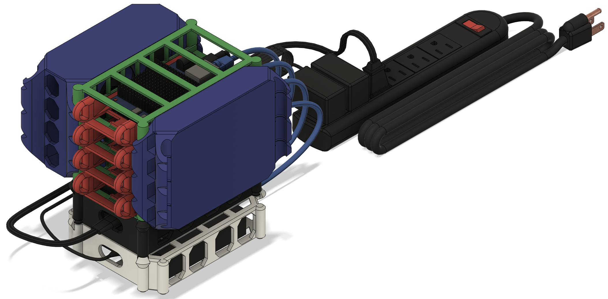


### 17. Check the connection and status of all the boards

ssh parallella@NOPA##

#### 17.1. Test C++ compiler (G++)
- Run a "Hello World" example

```
cd ~/tests/gpp
g++ hello_world.cpp -o hello_world
./hello_world
```

- Go to Laboratory 0 [A.3. Basic programming concepts (variables, loops, conditionals)](../../A_Single_Core/A_3/README.md)


#### 17.1. Test OpenMP

- Run a "Hello World" example

```
cd ~/tests/openmp
g++ -fopenmp hello_world_openmp.cpp -o hello_world_openmp
./hello_world_openmp
```

- Go to Laboratory 0 [B.6. Parallel programming models (OpenMP)](../../B_Multiple_Cores/B_6//README.md)


#### 17.2. Test MPI (MPICH)

- Run a "Hello World" example

```
cd ~/tests/mpich
mpic++ hello_world_mpi.cpp -o hello_world_mpi
cp hello_world_mpi ~/DEMAC_nfs/
cd ~/DEMAC_nfs/
mpirun --host nopa01,nopa02,nopa03,nopa04 hello_world_mpi
```

- Go to Laboratory 0 [D.4. Message Passing Interface (MPI)](../../D_Multiple_Nodes/D_4/README.md)
